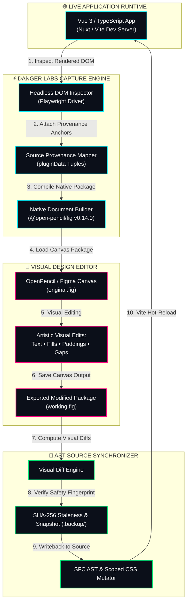

<div align="center">

  <br />
  
  <br />
  <br />

  <h1>⚡ CODE TO DESIGN</h1>
  <p><strong>ENTERPRISE BI-DIRECTIONAL VISUAL CANVAS ENGINE & SFC AST SYNCHRONIZER</strong></p>
  <p><i>Developed & Maintained by DANGER LABS Open Source Engineering</i></p>

  <br />

  <p>
    <a href="https://github.com/dr-week/Code-To-Figma-Converter/actions"></a>
    <a href="https://typescriptlang.org"></a>
    <a href="https://vuejs.org"></a>
    <a href="https://openpencil.dev"></a>
    <a href="LICENSE"></a>
  </p>

  <br />

  <p width="80%">
    <b>Code to Design</b> is Danger Labs' next-generation visual compilation system.<br />
    It transforms live browser-rendered Vue + TypeScript application interfaces into structurally editable OpenPencil & Figma layers, with 100% deterministic source provenance tracking and non-destructive AST writebacks.
  </p>

  <br />

</div>

---

> [!IMPORTANT]  
> **DANGER LABS PLATFORM STATUS: MILESTONES 1–5 FULLY VERIFIED**  
> All repository quality gates are operating at 100% compliance: **78/78 Vitest integration suites passing**, zero TypeScript compiler errors (`tsc`), zero ESLint lints, and clean package production builds across all monorepo modules.

---

## 💎 Architecture & Core Technology

Traditional design-to-code pipelines are unidirectional and lossy. **Danger Labs Code to Design** introduces a bi-directional visual compilation loop:

1. **Lossless DOM-to-Canvas Compilation**: Captures computed geometry, typography, colors, and layout constraints from live browser DOM instances using Playwright engine integration.
2. **Deterministic Source Anchoring (`pluginData`)**: Every visual canvas element is embedded with non-destructive metadata tuples `[sourceFile, sourceId, kind]` mapping directly back to your codebase.
3. **AST SFC Mutation Engine**: When visual layers are edited inside **[OpenPencil](https://openpencil.dev/)** or Figma, Danger Labs' AST transformer parses visual diffs and surgically updates `<template>` text nodes and `<style scoped>` CSS rules without corrupting script blocks or comments.
4. **Resilient Staleness & Conflict Engine**: SHA-256 fingerprinting prevents out-of-band overwrite conflicts with automated 3-way merge resolution and `.backup/` snapshots.

---

## 🎨 System Architecture & Workflow



---

## ⚡ Quick Start Guide

### 🚀 Interactive Launcher (Windows Batch Suite)

Launch Danger Labs' interactive terminal launcher:

```cmd
.\scripts\launch.bat
```

```
===================================================
             DANGER LABS // LAUNCHER
  Convert Live Vue UI to OpenPencil & Write Back Code
===================================================

Select an option:
[1] Start Vue UI Application (http://127.0.0.1:4174)
[2] Run UI Capture Pipeline (Generate original.fig)
[3] Run Visual Writeback (Apply working.fig edits)
[4] Run Full Repository Quality Gate (pnpm check)
[5] Exit
```

For 1-click execution of the live Web UI server:
```cmd
.\scripts\start-ui.bat
```

---

### 🛠️ Developer CLI Workflow

#### 1. Repository Installation

```bash
# Clone the official Danger Labs repository
git clone https://github.com/dr-week/Code-To-Figma-Converter.git
cd Code-To-Figma-Converter

# Install monorepo dependencies
pnpm install --frozen-lockfile

# Provision browser capture binaries
pnpm setup:browser
```

#### 2. Launch Local Dev Server

```bash
pnpm dev:vue
```
*Application available at `http://127.0.0.1:4174`.*

#### 3. Execute Visual Capture

```bash
pnpm capture --url http://127.0.0.1:4174 --out original.fig
```

#### 4. Perform Visual Edits in OpenPencil

- Open `original.fig` inside **[openpencil.dev](https://openpencil.dev/)**.
- Edit typography, solid fill colors, or container spacing visually.
- Save output as `working.fig`.

#### 5. Synchronize Edits to Source Code

```bash
pnpm writeback --original original.fig --working working.fig
```

---

## 🛡️ Enterprise Quality Verification Matrix

Danger Labs enforces rigorous quality controls across all workspace packages:

| Quality Gate | Command | Verification Status | Threshold |
| :--- | :--- | :---: | :---: |
| **TypeScript Compiler** | `pnpm typecheck` | `PASS` | `0 Errors` |
| **ESLint Static Analysis** | `pnpm lint` | `PASS` | `0 Warnings` |
| **Vitest Test Suite** | `pnpm test` | `PASS` | `78/78 Passing` |
| **Monorepo Package Build** | `pnpm build` | `PASS` | `Clean Output` |

Execute the full Danger Labs quality gate with a single command:
```bash
pnpm check
```

---

## 🏢 Monorepo Architecture Overview

```
CODE-TO-DESIGN // DANGER LABS MONOREPO
├── 📁 apps/
│   ├── 📄 cli/             # Danger Labs Command-Line Interface
│   └── 📄 figma-plugin/    # Figma Integration Plugin Package
├── 📁 packages/
│   ├── 📄 browser/         # Headless DOM Inspection & Playwright Driver
│   ├── 📄 contracts/       # Core TypeScript Interfaces & Schema Definitions
│   ├── 📄 core/            # AST Transformer, CSS Mutator & Conflict Engine
│   ├── 📄 figma/           # Document Parser & Scene Graph Engine (@open-pencil/fig)
│   └── 📄 tooling/         # Capture Orchestrators, Diff Engines & Backup Tools
├── 📁 scripts/             # Interactive Windows Launchers (launch.bat, start-ui.bat)
├── 📁 tests/              # End-to-End Vitest Integration Suite (78 Tests)
└── 📄 README.md            # Danger Labs Official Documentation
```

---

## 📄 License & Legal Notice

Distributed under the **MIT License**. See [`LICENSE`](LICENSE) for details.

```
Copyright (c) 2026 DANGER LABS INC. All rights reserved.
Code to Design is an open-source initiative maintained by Danger Labs Engineering.
```

<div align="center">
  <br />
  <p><strong>DANGER LABS // INNOVATION IN DESIGN-TO-CODE SYNCHRONIZATION</strong></p>
</div>
