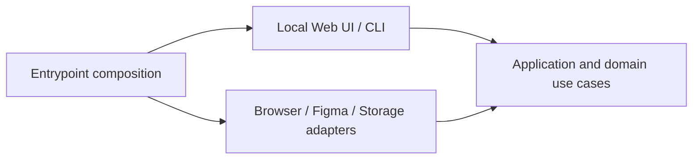
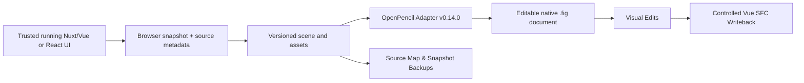

# Three-layer architecture

> **Status correction, 2026-09-13: Milestone 1 INCOMPLETE.** The completion/native-editor claims below are superseded by the [verification audit](../05-delivery/verification-audit.md). Existing output is custom prototype JSON, not verified OpenPencil output. Actual editor rendering, editing and save/reopen remain unverified. Milestone 2 work is inactive; retain its existing code without expanding it. Complete milestone-1 gates first.

**Current destination, 2026-09-12: OpenPencil.** Three layers and shared capture/validation still apply. Existing Figma diagrams below describe the prototype; only the destination adapter is under reconsideration. Do not build multiple editor adapters in parallel. See [OpenPencil requirements](../02-research/openpencil.md).

Interpretation of the requested “three architecture”: **three layers**, with small feature modules and dependency inversion. This is a proposed interpretation, not three separate architecture patterns or mandatory distributed tiers.

## Layers

1. **Presentation:** Local Vue web UI and CLI commands. Validate incoming transport shapes and call use cases. The Figma plugin remains inactive reference code.
2. **Application/domain:** capture orchestration, scene invariants, names, mapping policy, warnings, validation and import planning. Own interfaces for external operations.
3. **Infrastructure:** Playwright, asset loading, Figma Plugin API and filesystem. Implement the interfaces.

Arrows describe code dependencies. Runtime calls from use cases reach infrastructure through injected ports. Domain logic does not import React, Next.js, Playwright, Figma globals or database clients. Composition roots are the only place that selects concrete adapters.

## Module boundaries & Pure Domain Isolation

- `capture` collects DOM observations & assets;
- `naming` resolves explicit & inferred layer names;
- `scene` normalizes browser data into standard contracts;
- `openpencil-io` adapts normalized scene nodes to the native OpenPencil `.fig` scene graph;
- `source-mapping` owns layer-to-SFC component source anchors & pure template writeback logic (`applyTextWritebackContent`).

> [!IMPORTANT]
> **Pure Domain Rule:** Modules inside `packages/core` MUST remain pure domain logic with **zero platform runtime dependencies** (no `fs`, `crypto`, `path`, `playwright`, `react`, etc.). Platform-specific I/O adapters belong in infrastructure (`packages/browser` or `packages/tooling`).

## Deployment stages

Local CLI plus OpenPencil document artifacts and filesystem source backups. The source app runs in its own dev server; the converter needs no separate hosted backend or database.

The earlier dashboard, worker, PostgreSQL and queue proposal is superseded by the 2026-09-12 scope decision. These are not active architecture requirements.

## Failure model

Stages are capture, normalize, validate, package, edit, and writeback:

1. **Capture/Conversion Failures:** A capture failure aborts without generating invalid OpenPencil files.
2. **Writeback Failures:**
   - **Source Hash Mismatch:** If the target `.vue` file hash does not match `expectedSourceHash`, writeback aborts before touching disk.
   - **Dynamic Interpolation:** If the target element contains Vue dynamic bindings (`{{ ... }}`), writeback aborts to prevent AST corruption.
   - **Pre-edit Backup:** Every writeback creates an immutable `.backup/App.vue.<timestamp>.bak` snapshot before mutating source.

Use structured errors with code, stage, node ID and recovery action. Cancellation is checked between batches. Do not continue with silently corrupted geometry or silently renamed nodes.
